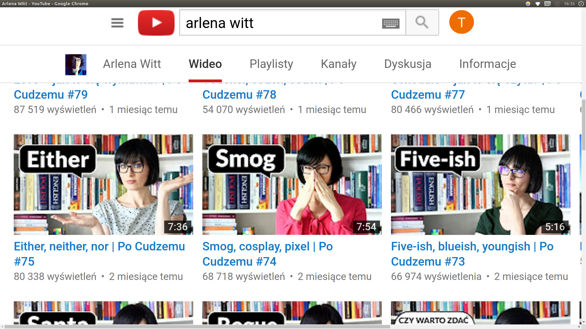

Text can be **bold**, _italic_, or ~~strikethrough~~.

[Link to another page](another-page).

There should be whitespace between paragraphs.

There should be whitespace between paragraphs. We recommend including a README, or a file with information about your project.

# [](#why)Watch vlogs to learn English

It's more funny and useful to learn English by watching blogs, firstly you learn words from the area that you are interested in. Secondly you can gain new knowledge that you need. At last it's more funny and you can do it whenever you want.

## [](#general)Vlogs about learning English

> [Arlena Witt vlog](https://www.youtube.com/user/jezykalnia)
>
> [English is fun](https://www.youtube.com/channel/UCHh5i83CFCk8DZyeEEIfZdA)
>
> [English Lessons](https://www.youtube.com/channel/UCwA7Aepp7nRUJNa8roQ-6Bw)

### [](#thematical)A few examples of thematical vlogs...

> [English Jade](https://www.youtube.com/channel/UCy-dvmsfmvYXBmt_huqqo1A)
>
> [iNcontrolLTV](https://www.youtube.com/user/iNcontroLTV)
>
> And much more!

### Arlena Witt - Polish vlog about learning English



```
We hope that we encouraged you to learn English!
```
